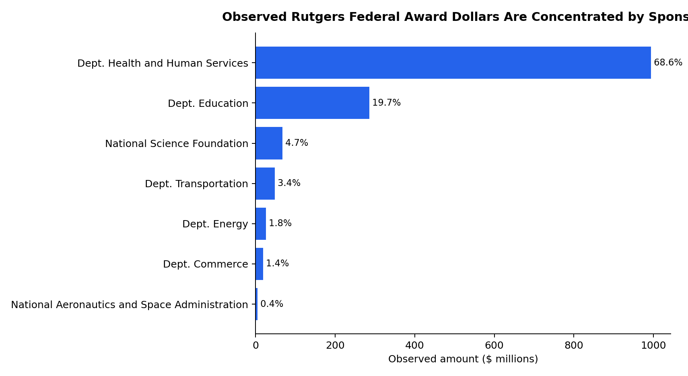
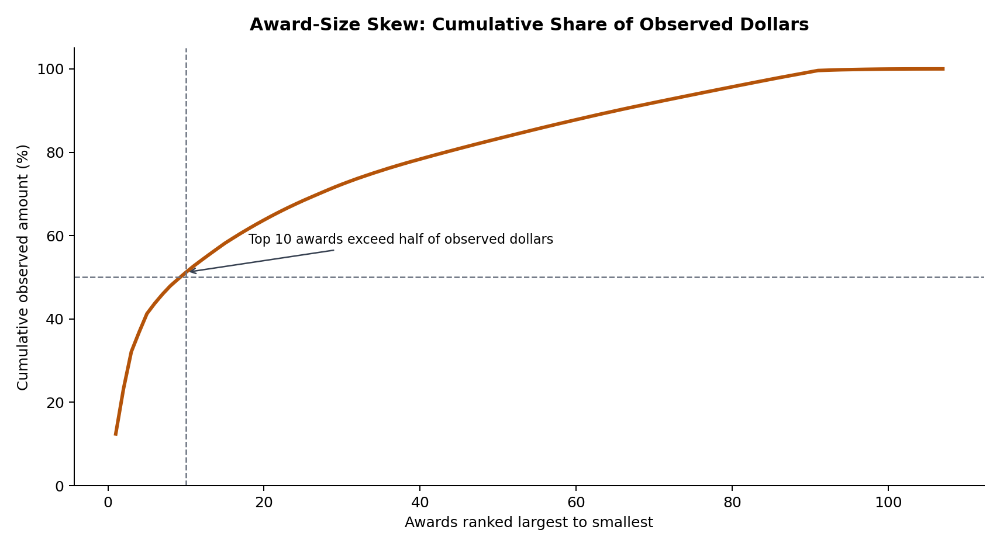
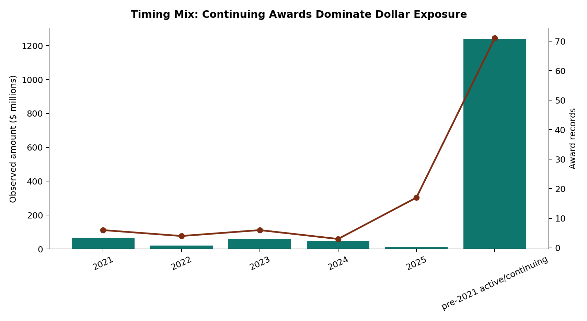

# Federal Research Grant Funding Analysis at Rutgers University

Generated: 2026-05-30T23:37:24Z

## Research Question

How concentrated is Rutgers' publicly observable federal award exposure across agencies and award sizes in the FY2021-FY2025 query window, and what can public federal feeds support before an internal Rutgers department crosswalk is required?

## Scope

This local RAIL project analyzes public federal award records matching Rutgers over FY2021-FY2025. It uses USAspending.gov for cross-agency federal assistance coverage and the NSF Awards API for additional research-award detail. The study is intentionally scoped as a public-data analysis, not an audited sponsored-research ledger.

## Method

The deterministic pipeline queries USAspending for Rutgers-matching assistance awards and the NSF Awards API for Rutgers-matching research awards, filters records whose active dates intersect the FY2021-FY2025 window, and normalizes them into a shared award panel. The analysis then computes agency totals, award counts, concentration measures, timing cohorts, top-award skew, and source-overlap checks. The concentration model uses a Herfindahl-Hirschman style agency index: each agency's observed dollar share is squared and summed, so values closer to one indicate greater dependence on a small number of agencies. This is a descriptive benchmark, not a causal model.

## Key Findings

- The processed public-data panel contains 107 Rutgers-matching award records returned for the FY2021-FY2025 query window totaling $1.45B.
- The largest observed agency total is Department of Health and Human Services with $993.8M across 72 records.
- Agency exposure is concentrated: the top agency accounts for 68.6% of observed amount, the top three agencies account for 93.1%, and the agency HHI is 0.514.
- Award-size skew is material: the ten largest records account for 51.2% of observed amount, while the median observed record is $6.7M.
- Timing analysis shows 71 continuing/pre-window records account for 85.7% of observed amount; 36 records started inside the FY2021-FY2025 window and account for $207.4M.
- Public federal award feeds do not provide a reliable Rutgers academic department crosswalk, so department-level performance profiles should be treated as a next-step internal-data join rather than inferred from titles alone.

## Results And Analysis

The agency comparison indicates that public Rutgers award exposure is not evenly distributed across federal sponsors. HHS dominates the observed dollar volume, while NSF contributes a larger share of research-award records than of total dollars. This matters for institutional planning because aggregate federal exposure can look healthy while still being vulnerable to changes in a few sponsor programs or long-running cooperative agreements.

Figure 1 is the main substantive result. The public award slice is not a broad, evenly diversified sponsor portfolio; it is dominated by a small set of agencies, especially HHS. That does not mean Rutgers' internal sponsored-research ledger has the same composition, because the public query includes continuing awards and assistance-style records, but it does mean any serious department or strategy analysis must normalize by sponsor exposure before drawing conclusions.

| Analysis metric | Value | Interpretation |
| --- | ---: | --- |
| observed_award_records | 107 | Rutgers-matching active public award records in the query window. |
| observed_amount | $1.45B | Total observed amount before cross-source deduplication. |
| agency_hhi | 0.513 | Agency concentration index; higher values indicate more concentrated public award exposure. |
| top_agency_share | 68.6% | Share of observed amount in the largest agency grouping. |
| top_three_agency_share | 93.1% | Share of observed amount in the three largest agency groupings. |
| top_ten_award_share | 51.2% | Award-size skew captured by the ten largest observed records. |
| median_award_amount | $6.7M | Median award amount, showing the typical record is far smaller than the top awards. |
| pre_2021_active_amount_share | 85.7% | Share of observed amount tied to awards that began before the FY2021 window but remained active or returned by the query. |
| new_window_record_count | 36 | Records with starts inside the FY2021-FY2025 query window. |
| cross_source_overlap_ids | 0 | Award IDs appearing in both USAspending and NSF slices; nonzero values would require deduplication before additive totals. |

The top-award comparison is the clearest substantive finding: Rutgers' public federal award profile in this slice is highly skewed. A small number of large HHS and Education records dominate the dollar total, while NSF adds many smaller research records. A simple top-award share and HHI benchmark are therefore more informative than raw counts alone. The result does not imply that Rutgers research is over-dependent on HHS in the audited internal ledger, but it does show that the public federal award signal is concentrated enough that any department ranking must normalize by sponsor, award type, and continuation status.

Figure 2 shows why counts are a weak analytical unit for this question. The first ten records account for more than half of observed dollars, so an award-count dashboard would overstate the importance of high-volume small-award sponsors and understate the planning risk tied to a few very large continuing records.

## Annual Snapshot

Figure 3 makes the timing caveat visible. Most observed dollars come from awards active in the window but beginning before FY2021, so this report should be read as exposure during FY2021-FY2025 rather than a clean series of new awards initiated during those years.

| Fiscal year | Award records | Observed amount |
| --- | ---: | ---: |
| 2021 | 6 | $67.4M |
| 2022 | 4 | $21.3M |
| 2023 | 6 | $59.7M |
| 2024 | 3 | $46.6M |
| 2025 | 17 | $12.4M |
| pre-2021 active/continuing | 71 | $1.24B |

## Top Observed Awards

| Source | Award ID | Agency | Amount | Program or title |
| --- | --- | --- | ---: | --- |
| USAspending.gov | U24MH068457 | Department of Health and Human Services | $179.7M | COOPERATIVE AGREEMENT (B) |
| USAspending.gov | P425F200193 | Department of Education | $157.6M | FORMULA GRANT (A) |
| USAspending.gov | P425E200365 | Department of Education | $128.3M | FORMULA GRANT (A) |
| USAspending.gov | P30CA072720 | Department of Health and Human Services | $68.2M | PROJECT GRANT (B) |
| USAspending.gov | U54AR055073 | Department of Health and Human Services | $64.0M | COOPERATIVE AGREEMENT (B) |
| USAspending.gov | U45ES006179 | Department of Health and Human Services | $35.9M | COOPERATIVE AGREEMENT (B) |
| USAspending.gov | P30ES005022 | Department of Health and Human Services | $32.0M | PROJECT GRANT (B) |
| USAspending.gov | UL1TR003017 | Department of Health and Human Services | $28.8M | COOPERATIVE AGREEMENT (B) |
| USAspending.gov | P01HL114471 | Department of Health and Human Services | $23.9M | PROJECT GRANT (B) |
| USAspending.gov | U19AI111276 | Department of Health and Human Services | $23.2M | COOPERATIVE AGREEMENT (B) |

## Robustness And Data Checks

- Source overlap check found 0 award IDs appearing in both the USAspending and NSF slices after active-window filtering.
- Records that began before FY2021 are reported as `pre-2021 active/continuing` rather than assigned to a current fiscal year, preventing old long-running awards from being misread as new FY2021-FY2025 starts.
- The analysis reports observed public records and does not add NSF totals to USAspending as audited unique dollars without an award-level reconciliation.

## Limitations

- USAspending award amounts are obligation-style federal award records and may include non-research assistance; filtering to Rutgers and assistance award types gives a broad federal-funding view, not an audited sponsored-research ledger.
- NSF records are useful for research-award detail but overlap with USAspending, so totals should not be added across sources without deduplication.
- A production departmental dashboard should join these public award IDs to Rutgers internal sponsored-program accounts, principal-investigator appointments, and faculty headcount.
- The public feeds do not support credible department-level comparisons on their own. The project therefore answers the public-data concentration question and blocks fabricated department rankings until internal crosswalk data is available.
